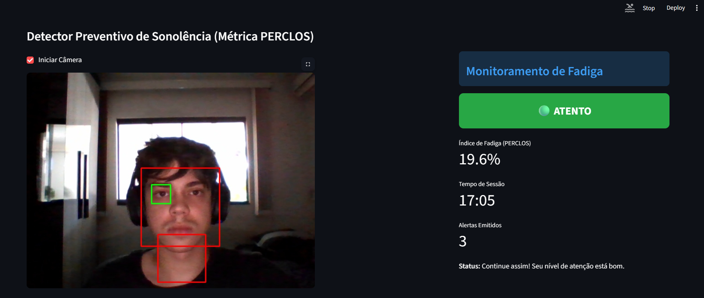

# FocusGuard AI – Monitoramento Preventivo de Fadiga via Visão Computacional

## Sobre o Projeto
O **FocusGuard AI** é um sistema inovador que utiliza Inteligência Artificial e Visão Computacional para monitorar e mitigar a fadiga humana em tempo real. Desenvolvido com foco em privacidade e execução local (Edge Computing), ele emprega a métrica internacional **PERCLOS** (Percentage of Eye Closure) para identificar proativamente sinais de exaustão, prevenindo micro-sonos e falhas de atenção antes que ocorram. Sua arquitetura flexível permite aplicação em diversos cenários críticos:

*   **Educação a Distância (EAD):** Atua como um assistente de produtividade, ajudando estudantes a manterem o foco durante aulas online.
*   **Trabalho Remoto (Home Office):** Contribui para a prevenção de Burnout e fadiga visual, promovendo bem-estar e eficiência.
*   **Segurança no Trânsito:** Oferece um mecanismo de alerta crucial para motoristas, prevenindo acidentes causados por sonolência ao volante.

## Diferenciais Técnicos
*   **Métrica PERCLOS Avançada:** Implementação robusta da métrica PERCLOS para análise temporal da abertura ocular, permitindo a detecção precisa da fadiga acumulada.
*   **Prevenção Proativa:** Emissão de alertas em dois níveis (Atenção e Crítico), garantindo intervenção antes que a fadiga se torne um risco.
*   **Execução em Background:** Notificações push nativas que funcionam de forma independente do estado do navegador, assegurando que os alertas sejam sempre entregues.
*   **Privacidade Total (Edge Computing):** Todo o processamento de imagens e dados ocorre localmente no dispositivo do usuário, sem envio de informações para a nuvem, garantindo a máxima privacidade.

## Tecnologias Utilizadas
O projeto FocusGuard AI é construído sobre uma pilha tecnológica robusta e moderna:

*   **Python:** Linguagem de programação principal para o desenvolvimento de todo o ecossistema.
*   **TensorFlow / Keras:** Frameworks para a construção, treinamento e execução da Rede Neural Convolucional (CNN) responsável pela classificação do estado ocular.
*   **OpenCV:** Biblioteca essencial para captura de vídeo, detecção facial e ocular, e processamento de imagens em tempo real.
*   **Streamlit:** Utilizado para criar a interface web interativa e intuitiva, exibindo telemetria de dados e o feed da câmera.
*   **PyTTSx3:** Biblioteca para síntese de voz, utilizada para gerar alertas auditivos claros e eficazes.
*   **Plyer:** Permite a integração com o sistema operacional para o envio de notificações nativas, garantindo que os alertas sejam visíveis mesmo com o aplicativo em segundo plano.
*   **Numpy:** Para operações numéricas eficientes, especialmente no pré-processamento de imagens e manipulação de dados do modelo.
*   **Scipy:** Utilizado para funções científicas e matemáticas que complementam o processamento de dados.
*   **Scikit-learn:** Para ferramentas de machine learning, possivelmente utilizadas em etapas de pré-processamento ou análise de dados.
*   **Mediapipe:** Uma estrutura para construir aplicações de visão computacional, que pode ser utilizada para detecção de pontos faciais e oculares.

## Estrutura do Projeto
```
focusguard-ia-main/
├── .gitignore             # Arquivo para ignorar arquivos e diretórios específicos do controle de versão
├── .vscode/               # Configurações do VS Code
├── app.py                 # Aplicação principal Streamlit e lógica de detecção PERCLOS
├── train_model.py         # Script para treinamento da Rede Neural Convolucional (CNN)
├── requirements.txt       # Lista de dependências do Python
├── README.md              # Este arquivo de documentação
├── models/                # Diretório contendo os modelos de IA treinados
│   ├── eye_model.h5       # Modelo de Deep Learning para classificação ocular
│   └── scaler.pkl         # Objeto scaler para pré-processamento de dados (se aplicável)
└── img.png                # Imagem da interface do Streamlit (será adicionada aqui)
```

## Dataset
O modelo de Deep Learning foi treinado utilizando o **MRL Eye Dataset**, um dos conjuntos de dados mais reconhecidos e robustos para detecção do estado ocular (aberto/fechado). Devido ao seu grande volume (mais de 80.000 imagens), o dataset completo não está incluído neste repositório.

### Como Obter e Organizar o Dataset para Treinamento:
1.  **Download:** Faça o download oficial do dataset através do [MRL Eye Dataset (Kaggle)](https://www.kaggle.com/datasets/akashshingha850/mrl-eye-dataset) ou do [site oficial da MRL](https://mrl.cs.vsb.cz/eyedataset.html).
2.  **Estrutura:** Após o download, organize os arquivos de imagem na seguinte estrutura de diretórios para que o script `train_model.py` possa utilizá-los corretamente:
    ```
    dataset/
    └── data/
        ├── train/
        │   ├── awake/             # Imagens de olhos abertos para treino
        │   └── sleepy/            # Imagens de olhos fechados para treino
        └── val/
            ├── awake/             # Imagens de olhos abertos para validação
            └── sleepy/            # Imagens de olhos fechados para validação
    ```

## Como Instalar e Rodar
Siga os passos abaixo para configurar e executar o FocusGuard AI em sua máquina local:

1.  **Clonar o Repositório:**
    ```bash
    git clone https://github.com/seu-usuario/focusguard-ia.git
    cd focusguard-ia
    ```
    *(Substitua `https://github.com/seu-usuario/focusguard-ia.git` pelo link do seu repositório GitHub)*

2.  **Instalar Dependências:**
    ```bash
    pip install -r requirements.txt
    ```

3.  **Treinar o Modelo (Opcional):**
    Se você deseja treinar o modelo do zero ou com um dataset diferente, siga as instruções da seção "Dataset" para organizar os dados e então execute:
    ```bash
    python train_model.py
    ```
    *Nota: O modelo `eye_model.h5` já está incluído no repositório, então este passo é opcional se você não quiser retreinar.* 

4.  **Executar a Aplicação Streamlit:**
    ```bash
    streamlit run app.py
    ```
    Após executar o comando, uma nova aba será aberta em seu navegador com a interface do FocusGuard AI.

## Funcionamento e Lógica
O FocusGuard AI opera através de um pipeline de processamento em tempo real:

1.  **Captura de Vídeo:** A webcam do usuário é acessada via OpenCV para capturar o feed de vídeo.
2.  **Detecção Facial e Ocular:** Classificadores em cascata (Haar Cascades) do OpenCV são utilizados para detectar faces e, subsequentemente, a região dos olhos dentro de cada face.
3.  **Classificação do Estado Ocular (CNN):** As imagens dos olhos detectados são redimensionadas e normalizadas, e então alimentadas a uma Rede Neural Convolucional (CNN) pré-treinada. Esta CNN classifica o estado de cada olho como "aberto" ou "fechado".
4.  **Cálculo PERCLOS:** O sistema mantém um histórico temporal do estado ocular. A métrica PERCLOS é calculada como a porcentagem de tempo em que os olhos permaneceram fechados dentro de uma janela de tempo deslizante (atualmente 4 segundos). Um PERCLOS elevado indica fadiga.
5.  **Sistema de Alerta Multimodal:**
    *   **Fadiga Média (PERCLOS > 40%):** Um alerta suave é emitido via síntese de voz (`pyttsx3`) sugerindo uma pausa.
    *   **Fadiga Alta/Crítica (PERCLOS > 75%):** Um alerta sonoro crítico é acionado, acompanhado de uma notificação push nativa (`plyer`) para garantir a atenção imediata do usuário.
6.  **Interface em Tempo Real:** A interface Streamlit exibe o feed da câmera, o status atual (Atento, Fadiga, Sonolento), o índice PERCLOS, o tempo de sessão e o número de alertas emitidos, proporcionando feedback visual contínuo.

## Interface do Usuário
Para visualizar a interface do FocusGuard AI em ação, consulte a imagem abaixo:



## Autor
**Filipe Fogaça** 
